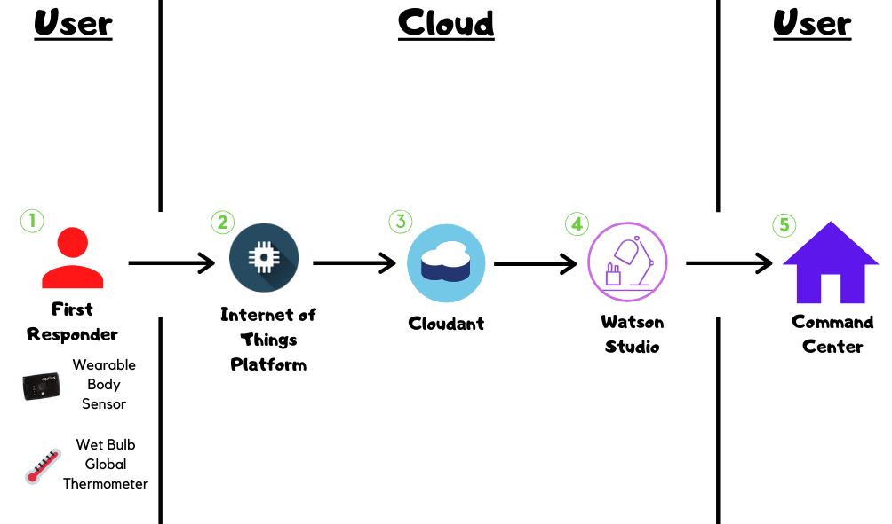
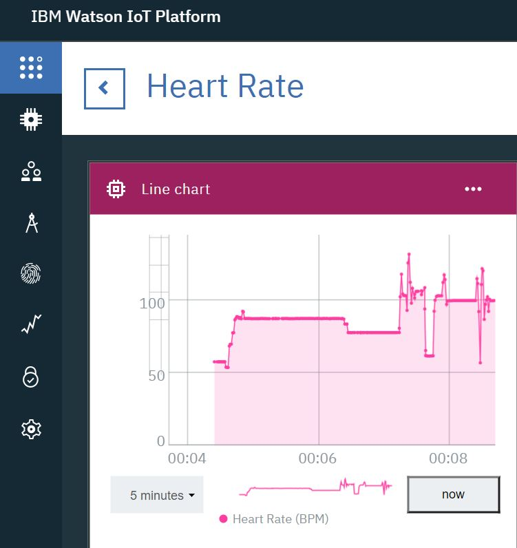
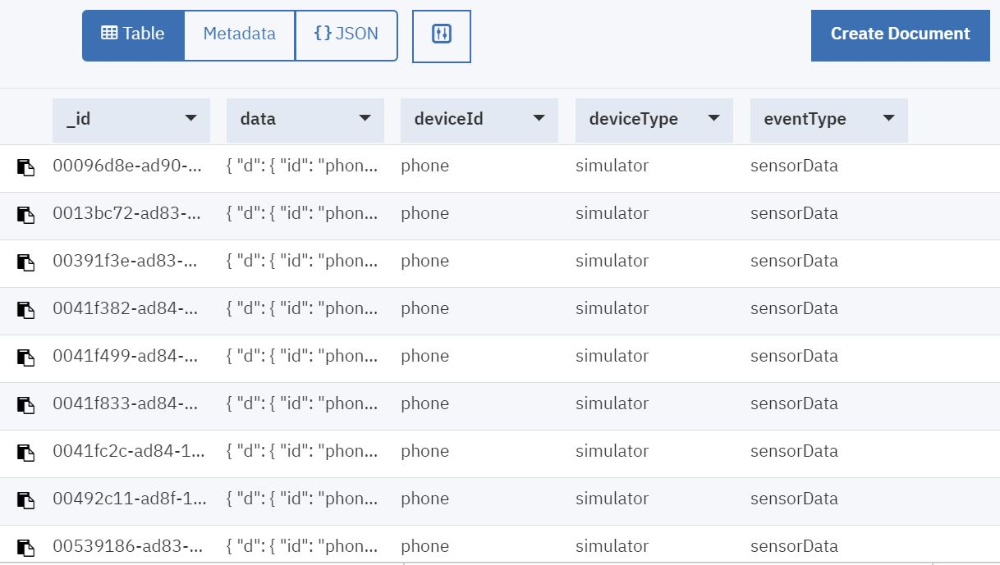
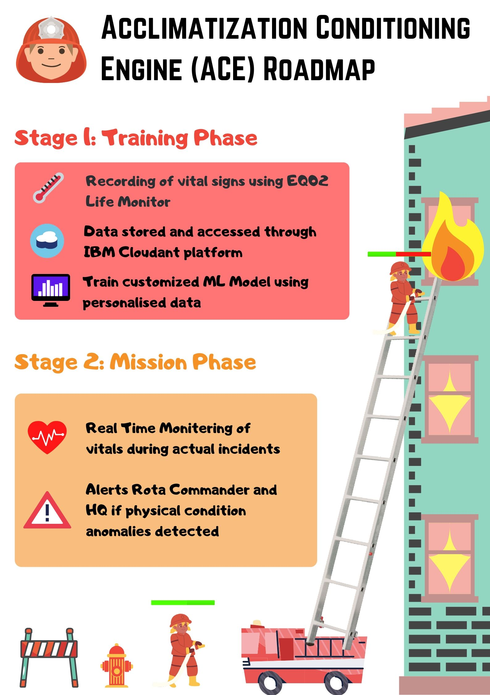

# RE Design Acclimatisation Conditioning Engine (ACE)

Team RE Design's proposed solution for SCDF X IBM Lifesavers' Innovation Challenge: Call for Code 2020.

## Contents

1. [Introduction](#introduction)
1. [Demo video](#demo-video)
1. [The architecture](#the-architecture)
1. [Project roadmap](#project-roadmap)
1. [Getting started](#getting-started)
1. [Running the tests](#running-the-tests)
1. [Live demo](#live-demo)
1. [Built with](#built-with)
1. [Authors](#authors)
1. [Acknowledgments](#acknowledgments)
1. [References](#references)

## Introduction

### What's the problem?

Climate change is inevitable, with projected increase in temperatures leading to phenomena such as the Urban Heat Island effect. This leads to an environment and climate where it is increasingly physically challenging for First Responders to train and operate to maximum efficiency and performance. How might SCDF leverage wearables or other technologies to provide relief or enhancement in harsh operating conditions and maximise the safety, health and performance of First Responders during training and operations?

### How can technology help?

Heat strain is a significant safety concern especially in the SCDF's line of work, worsened by projected environmental temperature increases. Not only is heat strain a safety concern, it also negatively affects performance and judgement [[1](#references)]. It is therefore crucial to monitor for signs of heat strain.

Currently, there are plenty of existing wearable technology to measure heat strain indicators, namely Hexoskin (Carré Technologies Inc., Montreal, Que., Canada), LifeMonitor EQ02 (Equivital, Cambridge, UK), BioHarness 3.0 (Zephr Performance Systems, Annapolis, Md., USA), Questemp II (3M, St. Paul, Minn., USA), BioNomadix (BIOPAC Systems, Inc., Goleta, Calif., USA), BioRadio (Great Lakes Neurotechnologies, Cleveland, Ohio, USA).

However most systems lack proper interpretation of physiological data to identify the signs and symptoms of excessive heat strain and merely displays what data it collects. Furthermore, they do not take into consideration the possible effects of climate change [[2](#references)].

### The idea

First Responders may face an increasing physical challenge because of the increased environmental temperature (ET) and humidity (EH), which affects their physiological and psychological states both before and during operations. ET and EH are thus critical factors to take into consideration to maximise safety and performance.

Since the SCDF is currently looking into integrating Equivital EQ02 LifeMonitor with wearable sensors in the Heat Strain Monitor System (HSM) [[3](#references)], we intend to leverage on this and build a more powerful model with the data collected from this system.

Our idea would be implemented in 2 phases: Training Phase, and Mission Phase.

**Training Phase**:
Individual physiological data (heart rate, core temperature [derive from skin temperature], breathing rate) from the wearable, as well as environmental data (ET and EH) from a WBGT device, would be captured and stored securely on IBM Cloud Object Storage after training. Our machine learning model, Acclimatisation Conditioning Engine (ACE), would then process the data via clustering and a time series analysis. A global threshold for each of the physiological data for a given environmental data would first be derived for anomaly detection. Our models will also learn the time-to-fatigue, which is how long a person can safely maintain their level of exertion, given their current vital signs and the prevailing environmental conditions. Following that, when sufficient data is collected, a personal threshold would be derived by giving individual data a higher weightage in the calculations.

**Mission Phase**:
The central hub would continue to monitor the soldiers' conditions. All soldiers would have a "health bar". When an anomaly is detected, be it during training or when soldiers are deployed, the central hub would notify the ground commander and HQ in the form of a depleting health bar, changing from green to yellow or red, depending on the number of thresholds breached by anomalous physiological data received. The estimated time-to-fatigue would also be displayed.

With this, both the ground commander and HQ can monitor the situation of all soldiers accurately as the model does not depend on a fixed index, but instead generates personal thresholds based on individualised data. Considering the highly volatile weather due to climate change, our customised thresholds provide a more accurate estimation of the soldiers' current "health".

## Demo video

[](https://youtu.be/vOgCOoy_Bx0)

## The architecture



1. EQ02 Life Monitor measures and transmits vitals information over wireless data link
2. Watson Internet of Things platform processes and visualises the information 
3. Watson Cloudant stores the information as a database on the cloud
4. Watson Studio utilizes Jupyter notebook to process the data and train the anomaly detection model





## Project roadmap



## Getting started

These instructions will get you a copy of the project up and running on your local machine for development and testing purposes. See deployment for notes on how to deploy the project on a live system.

### Prerequisites

What things you need to install the software and how to install them

```bash
dnf install wget
wget http://www.example.com/install.sh
bash install.sh
```

### Installing

A step by step series of examples that tell you how to get a development env running

Say what the step will be, for example

```bash
export TOKEN="fffd0923aa667c617a62f5A_fake_token754a2ad06cc9903543f1e85"
export EMAIL="jane@example.com"
dnf install npm
node samplefile.js
Server running at http://127.0.0.1:3000/
```

And repeat

```bash
curl localhost:3000
Thanks for looking at Code-and-Response!
```

End with an example of getting some data out of the system or using it for a little demo

## Running the tests

Explain how to run the automated tests for this system

### Break down into end to end tests

Explain what these tests test and why, if you were using something like `mocha` for instnance

```bash
npm install mocha --save-dev
vi test/test.js
./node_modules/mocha/bin/mocha
```

### And coding style tests

Explain what these tests test and why, if you chose `eslint` for example

```bash
npm install eslint --save-dev
npx eslint --init
npx eslint sample-file.js
```

## Live demo

You can find a running system to test at [callforcode.mybluemix.net](http://callforcode.mybluemix.net/)

## Built with

* [IBM Cloudant](https://cloud.ibm.com/catalog?search=cloudant#search_results) - The NoSQL database used
* [IBM Cloud Functions](https://cloud.ibm.com/catalog?search=cloud%20functions#search_results) - The compute platform for handing logic
* [IBM API Connect](https://cloud.ibm.com/catalog?search=api%20connect#search_results) - The web framework used
* [Dropwizard](http://www.dropwizard.io/1.0.2/docs/) - The web framework used
* [Maven](https://maven.apache.org/) - Dependency management
* [ROME](https://rometools.github.io/rome/) - Used to generate RSS Feeds

## Authors

* **Tan Liang Ming** - *Leader*
* **Loh Aik Hui**
* **Matthew Loo Jun Kuan**
* **Neo Lin How, Anthony**
* **Victor Gwee De Ming**

## Acknowledgments

* Based on [Billie Thompson's README template](https://gist.github.com/PurpleBooth/109311bb0361f32d87a2).

## References
1. Flouris, A. D., Dinas, P. C., Ioannou, L. G., Nybo, L., Havenith, G., Kenny, G. P., & Kjellstrom, T. (2018). Workers' health and productivity under occupational heat strain: a systematic review and meta-analysis. The Lancet Planetary Health, 2(12), e521-e531.
2. Notley, S. R., Flouris, A. D., & Kenny, G. P. (2018). On the use of wearable physiological monitors to assess heat strain during occupational heat stress. Applied physiology, nutrition, and metabolism = Physiologie appliquee, nutrition et metabolisme, 43(9), 869–881. doi:10.1139/apnm-2018-0173
3. SCDF (2018). REaction, Rescuers in action. https://www.scdf.gov.sg/docs/default-source/sgfpc-library/sgfpc/reaction-publication-2018-(november-edition).pdf
