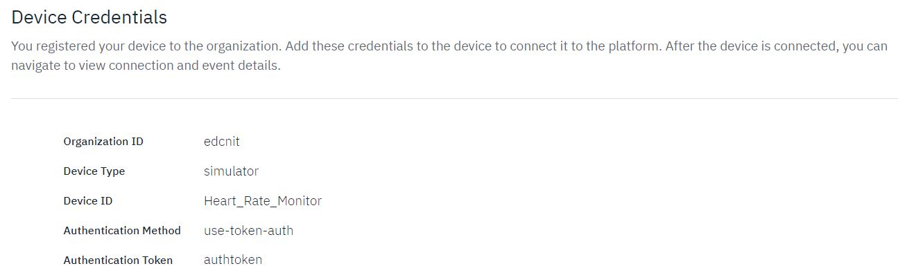
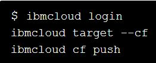
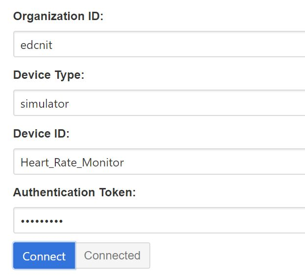
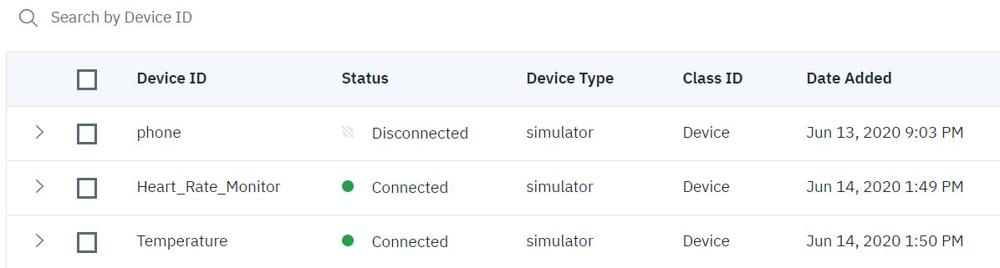
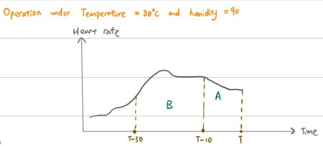
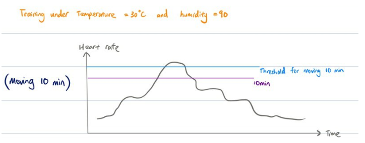
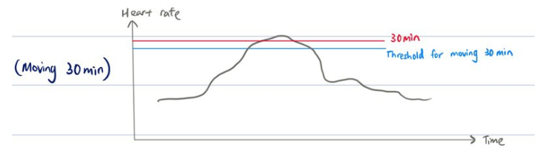

# RE Design Acclimatisation Conditioning Engine (ACE)

Team RE Design's proposed solution for SCDF X IBM Lifesavers' Innovation Challenge: Call for Code 2020.

## Contents

1. [Introduction](#introduction)
1. [Demo video](#demo-video)
1. [The architecture](#the-architecture)
1. [Project roadmap](#project-roadmap)
1. [Getting started](#getting-started)
1. [Future extensions](#future-extensions)
1. [Running the tests](#running-the-tests)
1. [Built with](#built-with)
1. [Authors](#authors)
1. [Acknowledgments](#acknowledgments)
1. [References](#references)

## Introduction

### What's the problem?

Climate change is inevitable, with projected increase in temperatures leading to phenomena such as the Urban Heat Island effect. This leads to an environment and climate where it is increasingly physically challenging for First Responders to train and operate to maximum efficiency and performance. How might SCDF leverage wearables or other technologies to provide relief or enhancement in harsh operating conditions and maximise the safety, health and performance of First Responders during training and operations?

### How can technology help?

Heat strain is a significant safety concern especially in the SCDF's line of work, worsened by projected environmental temperature increases. Not only is heat strain a safety concern, it also negatively affects performance and judgement [[1](#references)]. It is therefore crucial to monitor for signs of heat strain.

Currently, there are plenty of existing wearable technology to measure heat strain indicators, namely Hexoskin (Carré Technologies Inc., Montreal, Que., Canada), LifeMonitor EQ02 (Equivital, Cambridge, UK), BioHarness 3.0 (Zephr Performance Systems, Annapolis, Md., USA), Questemp II (3M, St. Paul, Minn., USA), BioNomadix (BIOPAC Systems, Inc., Goleta, Calif., USA), BioRadio (Great Lakes Neurotechnologies, Cleveland, Ohio, USA).

Although existing systems are capable of collecting huge amount of data, these data are often not optimally analysed to create maximum value. Furthermore, they do not take into consideration of the environmental conditions that are increasingly unpredictable due to climate change[[2](#references)].

### The idea

First Responders face an increasingly steep battle to perform due to the rising environmental temperature (ET) and humidity (EH). The physiological and psychological states of Responders have thresholds that vary with such environmental conditions. Hence, ET and EH are critical factors that should be evaluated to maximise safety and performance.

Since SCDF is currently looking into integrating Equivital EQ02 LifeMonitor with wearable sensors in the Heat Strain Monitor System (HSM) [[3](#references)], we intend to leverage on this to build a more intelligent analytical model using data collected from both the LifeMonitor and the Environmental Chamber.

Our idea would be implemented in 2 phases: Training Phase, and Mission Phase.

**Training Phase**:
Individual physiological data (heart rate, core temperature [derive from skin temperature], breathing rate) from the wearable, as well as environmental data (ET and EH) from environmental chamber, would be captured and stored securely on IBM Cloud Object Storage after training. Our machine learning model, Acclimatisation Conditioning Engine (ACE), would then process the data via clustering and a time series analysis. Our models will also learn the time-to-fatigue, which is how long a person can safely maintain their level of exertion, given their current vital signs and the prevailing environmental conditions. Following that, when sufficient data is collected, a personal threshold would be derived by giving individual data a higher weightage in the calculations.

**Mission Phase**:
In the Mission Phase, vital signs (collected by the wearable) and environmental data (from the WBGT device) are streamed to a central hub and fed into our multivariate anomaly detection models, where anomalies that exceed the ‘safe’ range of the respective time windows are flagged. For example, if the average readings in the past 10 minutes is recognised by our 10-minute model as an anomaly, the time-to-fatigue is less than 10 minutes. As the anomaly continues to be flagged,the “health bar” of the responder depletes (changing from green to yellow or red) and his time-to-fatigue drops, alerting ground commanders and HQ of his deteriorating state.

Considering the highly volatile weather due to climate change, our customised thresholds provide a more accurate estimation of the soldiers' current "health". ACE serves to monitor the Responders’ conditions accurately to enhance safety and maximise performance within SCDF despite the prevailing volatile climate. In doing so, ACE hopes to bring SCDF a step closer to becoming a world-leading life saving force.

## Demo video

[](https://youtu.be/6lHP4fo25g4)

## The architecture


1. **EQ02 Life Monitor** measures and transmits vitals information over wireless data link
2. **Watson Internet of Things** platform processes and visualises the information
3. **Watson Cloudant** stores the information as a database on the cloud
4. **Watson Studio** utilizes **Jupyter notebook** to process the data and train the anomaly detection model

## Project roadmap


## Getting started

### Prerequisites
IBM Cloud CLI

Create a new Notebook on IBM Watson Studio and Import Packages
```bash
import numpy as np
import pandas as pd
import matplotlib as plt
import types
import io
from botocore.client import Config
import ibm_boto3
import seaborn as sb
```
### Watson Internet of Things Platform	
Create and launch an instance of Watson Internet of Things platform	
	

Integrate local devices by adding devices to the IoT platform. Set Device type, Device ID and authentication token.	
	

Using the IBM Cloud CLI, push a web application onto the IBM Cloud	

	

IoT devices like the EQ02 Life Monitor and WBGT thermometer can connect and send data to the IoT platform via the web application	
	

The status of the devices can be monitored through the IoT platform	
	

Live feed from the different monitors can be displayed and viewed	
Watson Internet of Things: <br>	
	

### IBM Cloudant	
Historical data for each individual is then stored on IBM cloudant to be accessed in the future.	
Cloudant Database: <br>	


### Installing

Upload the following .csv files under examples/res to your Asset folder
  1. 5 sets of training dataset (SCDF_dataset1.csv -  SCDF_dataset5.csv)
  2. 1 set of test dataset: (SCDF_dataset_test1.csv)

Include a cell to store your IBM Watson Studio credentials in a dictionary. The format is as follows:

```bash
credentials = {
    'IAM_SERVICE_ID': '*****',
    'IBM_API_KEY_ID': '*****',
    'ENDPOINT': 'https://s3-api.us-geo.objectstorage.service.networklayer.com',
    'IBM_AUTH_ENDPOINT': 'https://iam.cloud.ibm.com/oidc/token',
    'BUCKET': '*****'
}
```
For easier access to the 5 training datasets:

```bash
n_datasets = 5
dfs = []

for i in range(n_datasets):
    body = client.get_object(Bucket=credentials['BUCKET'],Key='SCDF_dataset%i.csv'%(i+1))['Body']
    # add missing __iter__ method, so pandas accepts body as file-like object
    if not hasattr(body, "__iter__"): body.__iter__ = types.MethodType( __iter__, body )
    df_time = pd.read_csv(body, header=0, parse_dates=[0], index_col=0, squeeze=True)
    dfs.append(df_time.copy())
```
We have provided 5 sets of training datasets (5 training datasets each having differing environmental conditions)
and 1 set of test dataset in the .csv format.
The datasets are created by us to simulate real life conditions with varying external temperature and humidity
These files would be used primarily to build the anomaly detection model as a proof of concept.

## Running the tests

In our code, we experimented with 3 different sliding windows of duration (10min, 30min and 1 hour).
X contains 5 sets of data obtained from trainings under different 5 environmental conditions.

  1. Using df_10min and df_30min, we can calculate the average data (E.g Ext temp, Humidity etc)
     over a 10min and 30min window respectively.
  ```bash
  # Extract the Features from the Data
  X1 = pd.DataFrame(df_10min[["Ext Temp", "Humidity", "Core Temp", "Heart Rate", "Breathing Rate", "PSI"]])

  # Extract the Features from the Data
  X2 = pd.DataFrame(df_30min[["Ext Temp", "Humidity", "Core Temp", "Heart Rate", "Breathing Rate", "PSI"]])
  ```

  2. Local Outlier Factor was chosen as our anomaly detection algorithm where the local deviation in density
     of a datapoint is measured with respect to its neighbours. An anomaly is then flagged if the datapoint
     is sufficiently isolated compared to its neighbouring points. This trained model allows us to flag the data point
     as anomalous during operations and trainings if it deviates significantly from the data points of trainings under
     similar environmental conditions.

  ```bash
  # Create Anomaly Detection Model using LocalOutlierFactor
  lof = LocalOutlierFactor(n_neighbors = num_neighbors, contamination = cont_fraction)
  ```

  3. Num_neighbours refer to the number of nearest neighbours whose density will be compared with the new
     datapoint. cont_fraction is set at a small value of 0.00025 as an example as we expect training to be
     conducted in a safe environment. These 2 parameters can be further optimised with other data collected
     in SCDF. As an example, we have set the parameters as 10 and 0.00025 for num_neighbours and cont_fractions.

  ```bash
  # Set the Parameters for Neighborhood
  num_neighbors = 10      # Number of Neighbors
  cont_fraction = 0.00025    # Fraction of Anomalies
  ```

 4. The model is then fitted onto data obtained from training.

  ```bash
  # Fit the Model on the Data and Predict Anomalies
  lof.fit(X)
  ```

 5. After the model is built, we load the test dataset (SCDF_dataset_test1.csv) and use the model to
    predict anomalies in the test dataset.

  ```bash
  #Load test dataset
  body = client.get_object(Bucket=credentials['BUCKET'],Key='SCDF_dataset_test1.csv')['Body']
  # add missing __iter__ method, so pandas accepts body as file-like object
  if not hasattr(body, "__iter__"): body.__iter__ = types.MethodType( __iter__, body )
  real_time_data = pd.read_csv(body,  header=0, parse_dates=[0], index_col=0, squeeze=True)
  real_time_data.head()
  anomaly_or_not = clf.predict(real_time_data)
  ```

  6. A warning will only be displayed if 10 consecutive anomalies are detected. The counterLimit can be changed
     accordingly to tune the sensitivity of the detection system. For example, if mission setting is high risk,
     counterLimit should be set to a lower value.

  ```bash
  counter = 0
  counterLimit = 10

  for i in range(0, anomaly_or_not.size):
      if (anomaly_or_not[i] == -1):
        counter += 1
          if counter >= counterLimit:
              print("Limit has been reach at datapoint", i, "at time =", i*5, "s")
      else:
          counter = 0
   ```
### Interpreting the results
The main advantage of our model is that it allows commanders to accurately estimate the time-to-fatigue
of the responders in an operation.


For illustration purposes, we will only use 1 input variable (Heart rate) to reflect scenario 3 shown above.

The average heart rate of the responder for the past 10 and 30 minutes are calculated. (We chose to use average but this model can be further optimised by taking into account trends, weighted average etc). The data is continuously updated in intervals of 5 seconds as new data is collected and sent to the Watson IoT platform.



We are able to determine if the 10min rolling average data for a specific responder during operation is an anomalous result compared to the 10min rolling average of the responder’s own training data under similar environmental conditions.



This process is repeated with a 30 min window.



The thresholds are determined by the cont_fraction in the model which was implemented above. This variable can be further optimised.

### Conclusion

The 10 min threshold was not exceeded but the 30 min threshold has been exceeded. This implies that based on the responder's vital data, the responder is unlikely to be able to continue operations for another 30 mins. However, he is likely to be able to continue for another 10 min. Hence, his time-to-fatigue is less than 30 mins.

### Benefits of sliding window
Using windows of different time periods, this allows commanders to judge the useful timespan of his responders. Not only does this ensure the safety of responders by allowing commanders to extract them when they are exhausted, this technology also allows commanders to better plan their manpower real time in search and rescue operations.

Our model is novel because it creates a cluster of normal data points for every set of environmental conditions.
This allows us to easily flag anomalous data points pertaining to the specific environmental condition. However,
our model will only work well if the model has been trained with a good range of different environmental conditions.
Otherwise, an anomaly might be flagged because of anomalous environmental conditions and not because of anomalous
vital signs.

## Future extensions
**Further analysis of data points**:

We can incorporate a distance algorithm that measures how serious the deviations of the anomalies are to gauge the direness of the responder’s condition. We can also include the detection of points that could potentially lead to anomalies using predictive machine learning (leverage from DSO’s predictive analysis for the Heat Sensor Monitor). This would allow commanders to better gauge the condition of the teams.

Eg. If heart rate deviates significantly from the threshold, a critical warning will be displayed regardless of all other factors

**Enhanced intervention**:

Besides simply having just warning signs and notifications from the anomaly detection system, we can incorporate other physical mechanisms that can provide instantaneous relief during very serious states (eg. when prolonged consecutive anomalies detected).

**Incorporating performance data**:

Given that mental and physical performance would diminish far before the time-to-fatigue, it would be important to have an indication of the responder’s performance. To achieve this, we would need data on the responder’s performance during trainings, which could be obtained through evaluation from instructors, peers and self.


## Built with
* [IBM Internet of Things](https://cloud.ibm.com/catalog/services/internet-of-things-platform) - Communication hub between devices
* [IBM Cloudant](https://cloud.ibm.com/catalog?search=cloudant#search_results) - The NoSQL database used
* [Watson Studio] (https://cloud.ibm.com/catalog/services/watson-studio) - Jupyter notebook utilized

## Authors

* **Tan Liang Ming** - *Leader*
* **Loh Aik Hui**
* **Matthew Loo Jun Kuan**
* **Neo Lin How, Anthony**
* **Victor Gwee De Ming**

## Acknowledgments

We would like to express our thanks to SCDF for providing us insights to the Civil Defence Force and their operations and IBM for providing us this opportunity to understand the features of IBM cloud.  

## References
1. Flouris, A. D., Dinas, P. C., Ioannou, L. G., Nybo, L., Havenith, G., Kenny, G. P., & Kjellstrom, T. (2018). Workers' health and productivity under occupational heat strain: a systematic review and meta-analysis. The Lancet Planetary Health, 2(12), e521-e531.
2. Notley, S. R., Flouris, A. D., & Kenny, G. P. (2018). On the use of wearable physiological monitors to assess heat strain during occupational heat stress. Applied physiology, nutrition, and metabolism = Physiologie appliquee, nutrition et metabolisme, 43(9), 869–881. doi:10.1139/apnm-2018-0173
3. SCDF (2018). REaction, Rescuers in action. https://www.scdf.gov.sg/docs/default-source/sgfpc-library/sgfpc/reaction-publication-2018-(november-edition).pdf
